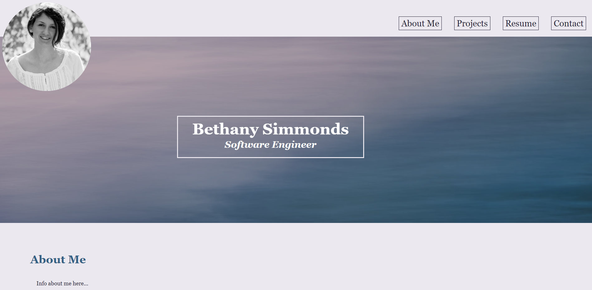

# <My Portfolio>

## Description

This is webpage is my portfolio and includes an introduction to me, my experience, and a selection of the projects that I have completed as a web developer. This webpage contains all of my professional information in one, organized place. It acts as an introduction to me and my work.

## Installation

N/A

## Usage

The webpage includes an about me, projects, resume, and contact sectsions. To see my projects, click on the project you'd like to see, and to view my resume, click on the "view my resume" box.

